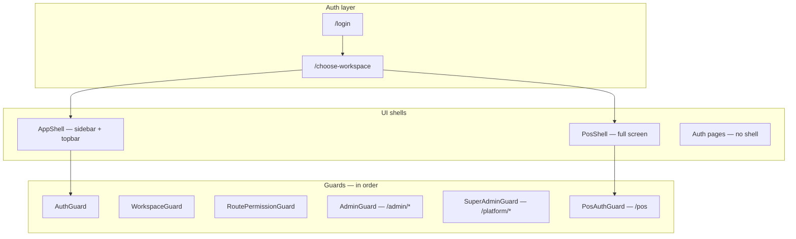

# Centrix POS/ERP — System & Navigation Reference

> **Purpose:** Read this document to understand how the web app is organized — routes, workspaces, sidebar links, permissions, and modules. Upload it to an AI assistant when you want help reorganizing navigation or simplifying information architecture.
>
> **Repos:** `centrix-erp-frontend-web` (Next.js frontend) + `centrix-erp-backend-api` (Laravel API). This doc focuses on the web app; module/permission truth lives in the API config files.

---

## 1. What this system is

Centrix is a multi-module ERP for wholesale/retail with:

| Surface | URL | Shell | Who uses it |
|---------|-----|-------|-------------|
| **Backoffice ERP** | `/dashboard`, `/sales`, `/inventory`, … | Sidebar + topbar (`AppShell`) | Managers, ops, back-office staff |
| **Create order (embedded POS)** | `/sales/pos` | Same sidebar, POS fills main area | Cashiers inside ERP |
| **External POS** | `/pos` | Full-screen (`PosShell`, no sidebar) | Dedicated cashier terminals |
| **Accounting workspace** | `/accounting/*` | Sidebar filtered to accounting | Finance team |
| **HR workspace** | `/hr/*` | Sidebar filtered to HR | HR/payroll |
| **Admin workspace** | `/admin/*` | Sidebar filtered to admin | Org administrators |
| **Platform console** | `/platform/*` | Sidebar (platform section only) | Super-admin managing tenants |

One login. After sign-in, users with access to multiple **workspaces** pick an application on `/choose-workspace`. Each workspace shows a **filtered subset** of the same global nav config.

---

## 2. High-level architecture



### Data that drives visibility

After login, the frontend loads **`GET /erp/capabilities`**, which includes:

| Field | Controls |
|-------|----------|
| `modules` | Org-level feature toggles (e.g. `sales.pos`, `inventory`, `hr_payroll`) |
| `permissions` | User-level permission map (e.g. `sales.orders.view`) |
| `workspaces` | Which applications appear on workspace picker |
| `module_settings` | Org preferences (sales workflow, finance/M-Pesa, mobile, distribution, …) |
| `deployment_profile` | Wholesale/retail profile presets |

**Three filters** decide whether a link appears:

1. **Module enabled** — org has the feature (`item.module`)
2. **Permission granted** — user can access (`item.permission`)
3. **Workspace scope** — link belongs to active workspace (`workspaces.js`)

Additional conditional flags: `requireTillFloat`, `requireMobileLoadingSheets`, `requireAdmin`, `superAdminOnly`, `orgAdminOnly`, report-specific checks.

---

## 3. Workspaces (product applications)

Defined in API: `config/erp_workspaces.php`  
Consumed in web: `src/lib/workspaces.js`, `src/lib/workspace-reports.js`

| ID | Label | Home path | Domain modules | Permission prefixes |
|----|-------|-----------|----------------|---------------------|
| `pos` | External POS | `/pos` | `sales.pos` | `pos.*` (entry: `pos.terminal.view`) |
| `backoffice` | Backoffice | `/dashboard` | sales, inventory, customers_suppliers, distribution | catalogue, customers, sales, inventory, purchasing, fulfillment, reports |
| `admin` | Administration | `/admin` | admin | admin.* |
| `accounting` | Accounting | `/accounting` | accounting, payments | accounting.*, payments.* |
| `hr` | Human Resources | `/hr` | hr_payroll | hr.* |

**Super-admin** on org `PLATFORM` → no workspaces; lands on `/platform` only (tenant ERP hidden).

### Workspace → sidebar sections

| Workspace | Sidebar section IDs shown |
|-----------|---------------------------|
| `pos` | *(none — PosShell has no sidebar)* |
| `backoffice` | dashboard, sales, inventory, purchases, logistics, reports |
| `admin` | users, settings |
| `accounting` | accounting, reports |
| `hr` | hr, reports |

Platform section (`platform`) is shown only to super-admins regardless of workspace.

### Workspace → URL prefixes

Paths outside the active workspace are **blocked** by `RoutePermissionGuard` (`canAccessRoute` in `route-access.js`).

| Workspace | Owns these path prefixes |
|-----------|--------------------------|
| `pos` | `/pos`, `/sales/pos` |
| `backoffice` | `/dashboard`, `/sales`, `/inventory`, `/products`, `/categories`, `/customers`, `/suppliers`, `/lpo`, `/fulfillment`, `/routes`, `/vats`, … |
| `admin` | `/admin` |
| `accounting` | `/accounting`, `/expenses`, `/finance` |
| `hr` | `/hr`, `/employees` |
| *(shared)* | `/profile`, `/choose-workspace` |

Reports (`/reports/*`) are split by **report module** — see §6.

---

## 4. Navigation pipeline (how links are built)

```
nav-config.js (navSections — master list)
    ↓
workspace-nav.js (buildWorkspaceNavSections)
    ├── Expand dynamic sales order queues (order-workflow.js)
    ├── Filter by isNavItemVisible (module + permission + flags)
    └── filterNavSectionsForWorkspace (workspace section + path rules)
    ↓
sidebar.jsx (render collapsible sections + group labels)
    ↓
route-access.js (canAccessRoute — block direct URL access)
```

**Single source of truth for links:** `src/lib/nav-config.js` → `navSections`

**Search:** Global nav search uses the same filtered list (`flattenNavSearchEntries`).

---

## 5. Current sidebar structure (master nav)

Below is the **full** nav as configured today. Items may be hidden per user/org/workspace.

### Platform *(super-admin only)*

| Link | Notes |
|------|-------|
| `/platform` | Platform overview |
| `/platform/organizations/new` | Register organization |

### Dashboard

| Link | Group | Module | Permission |
|------|-------|--------|------------|
| `/dashboard` | — | — | dashboard.overview.view |
| `/sales` | Analytics | sales.dashboard | sales.dashboard.view |
| `/inventory` | Analytics | inventory.dashboard | inventory.stock.view |
| `/accounting` | Analytics | accounting.dashboard | accounting.dashboard.view |
| `/hr` | Analytics | hr_payroll.dashboard | hr.employees.view |
| `/fulfillment` | Analytics | distribution.dashboard | fulfillment.drivers.view |

*Analytics links only appear in the workspace that owns that dashboard (backoffice gets sales/inventory/fulfillment; accounting gets `/accounting`; HR gets `/hr`).*

### Sales

| Link | Group | Module | Notes |
|------|-------|--------|-------|
| `/sales/pos` | Sales POS | sales.pos | **Create order** (embedded POS) |
| `/sales/till-management` | POS | sales.pos | Requires till float setting |
| `/sales/end-of-day` | POS | sales.pos | |
| `/sales/orders` + queue links | Sales orders | sales.backend | **Dynamic** — expands to workflow queues (Booked, Pending, …) |
| `/sales/loading-sheets` | Sales orders | sales.backend | Only when mobile orders ON and distribution OFF |
| `/sales/vouchers` | Sales | sales.backend | |
| `/sales/loyalty-cards` | Sales | sales.backend | |
| `/sales/reservations` | Sales | sales.backend | |
| `/sales/returns` | Credit notes | sales.backend | Label: "Credit notes" |
| `/reports/daily-sales` | Sales reports | sales.reports | Report link inside Sales section |
| `/reports/till-sessions` | Sales reports | sales.reports | Report link inside Sales section |
| `/customers` | Customers | customers_suppliers | |

### Inventory

| Link | Group | Module |
|------|-------|--------|
| `/products` | Catalog | — (catalogue permissions) |
| `/categories` | Catalog | — |
| `/uoms` | Catalog | — |
| `/retail-package-settings` | Catalog | — |
| `/vats` | Catalog | — |
| `/price-history` | Catalog | — |
| `/inventory/stock` | Stock | inventory |
| `/inventory/damages` | Stock | inventory |
| `/inventory/transfers` | Stock | inventory |
| `/inventory/transfers/new` | Stock | inventory |
| `/inventory/stock-take` | Stock | inventory |
| `/inventory/transactions` | Stock | inventory |
| `/reports/stock-on-hand` | Stock reports | inventory.reports |
| `/reports/stock-movement` | Stock reports | inventory.reports |

### Purchases

| Link | Group | Module |
|------|-------|--------|
| `/suppliers` | Suppliers | customers_suppliers |
| `/lpo` | Purchasing | customers_suppliers |
| `/inventory/receipts` | Purchasing | inventory |
| `/suppliers/payments` | Purchasing | customers_suppliers |
| `/suppliers/returns` | Purchasing | customers_suppliers |

### Accounting

| Link | Group | Module |
|------|-------|--------|
| `/accounting/chart-of-accounts` | — | accounting |
| `/accounting/journal-entries` | — | accounting |
| `/accounting/general-ledger` | — | accounting |
| `/accounting/accounts-receivable` | — | accounting |
| `/accounting/customer-invoices` | — | payments |
| `/accounting/accounts-payable` | — | accounting |
| `/expenses` | — | accounting |
| `/accounting/trial-balance` | Financial statements | accounting |
| `/accounting/balance-sheet` | Financial statements | accounting |
| `/accounting/profit-loss` | Financial statements | accounting |
| `/accounting/cash-flow` | Financial statements | accounting |
| `/accounting/fiscal-periods` | Setup | accounting |
| `/accounting/account-mappings` | Setup | accounting |
| `/accounting/export-queue` | Setup | accounting |
| `/accounting/settings` | Setup | accounting |

### Human resources

| Link | Group | Module |
|------|-------|--------|
| `/hr/employees` | — | hr_payroll |
| `/hr/departments` | — | hr_payroll |
| `/hr/positions` | — | hr_payroll |
| `/hr/kpis` | — | hr_payroll |
| `/hr/attendance` | — | hr_payroll |
| `/hr/leave` | — | hr_payroll |
| `/hr/payroll` | — | hr_payroll |
| `/hr/shifts` | Benefits & pay | hr_payroll |
| `/hr/allowances` | Benefits & pay | hr_payroll |
| `/hr/deductions` | Benefits & pay | hr_payroll |
| `/hr/overtime` | Benefits & pay | hr_payroll |
| `/hr/cash-advances` | Benefits & pay | hr_payroll |

### Logistics

| Link | Group | Module |
|------|-------|--------|
| `/fulfillment/dispatch` | — | distribution |
| `/fulfillment/trips` | — | distribution |
| `/fulfillment/pod-records` | — | distribution |
| `/fulfillment/drivers` | Fleet management | distribution |
| `/fulfillment/vehicles` | Fleet management | distribution |
| `/fulfillment/routes` | Fleet management | distribution |
| `/fulfillment/schedules` | Fleet management | distribution |

### Reports *(dynamic section)*

Built by `buildReportNavItems()` in nav-config:

| Link | Group | Workspace visibility |
|------|-------|---------------------|
| `/reports` | Overview | backoffice, accounting, hr (if any report module enabled) |
| `/reports/builder` | Custom Reports | same |
| `/reports/customer-statement` | Custom Reports | accounting (+ permission fallbacks) |
| `/reports/{slug}` | By section (Sales, Inventory, Finance, HR, Operations) | Filtered by `WORKSPACE_REPORT_MODULES` |

**Featured report slugs** (in Reports section): daily-sales, sales-by-product, stock-on-hand, profit-loss, payroll-summary, etc. — see `src/lib/reports/definitions.js` and `src/lib/module-registry.js`.

**Note:** Some reports also appear **inside** Sales and Inventory sections (duplicate entry points).

### User management *(admin workspace)*

| Link | Notes |
|------|-------|
| `/admin/users` | orgAdminOnly |
| `/admin/roles` | orgAdminOnly |
| `/admin/audit` | orgAdminOnly |

### Settings *(admin workspace)*

| Link | Group | Notes |
|------|-------|-------|
| `/admin` | — | Admin overview |
| `/admin/company` | — | |
| `/admin/branches` | — | |
| `/vats` | Tax & payments | **Duplicate** — also under Inventory catalog |
| `/admin/settings` | — | System preferences (tabbed) |
| `/admin/payment-methods` | Tax & payments | |
| `/admin/kra-responses` | Tax & payments | |

---

## 6. Reports — split across workspaces

| Workspace | Report modules shown |
|-----------|---------------------|
| backoffice | sales.reports, inventory.reports, customers_suppliers.reports |
| accounting | accounting.reports |
| hr | hr_payroll.reports |

Slug → module mapping: `src/lib/module-registry.js` (`REPORT_MODULE_BY_SLUG`).

---

## 7. Module tree (org-level toggles)

API: `config/erp_module_tree.php`

Domain roots are **master switches**. Turning off `sales` disables all sales.* children.

```
sales
├── sales.pos          (POS / till / checkout)
├── sales.mobile       (Mobile app orders)
├── sales.backend      (Orders, vouchers, returns, …)
├── sales.dashboard
└── sales.reports

inventory
├── inventory.dashboard
└── inventory.reports

customers_suppliers   (customers, suppliers, LPO, purchasing reports)
├── customers_suppliers.dashboard
└── customers_suppliers.reports

accounting
├── payments           (Customer invoices, receivables)
├── accounting.dashboard
└── accounting.reports

hr_payroll
├── hr_payroll.dashboard
└── hr_payroll.reports

distribution          (Logistics / fulfillment)
├── distribution.dashboard
└── distribution.reports

admin                 (Users, roles, org settings)
```

Platform super-admin enables/disables these per organization on `/platform/organizations/[id]`.

---

## 8. Organization settings (not in main sidebar)

**URL:** `/admin/settings` — tabbed panels gated by module:

| Tab | Modules required |
|-----|------------------|
| General | admin |
| Sales | sales |
| Mobile app | sales.mobile |
| Distribution | distribution |
| Inventory | inventory |
| Procurement | customers_suppliers |
| Finance | accounting, payments |
| AI assistant | admin |
| HR | hr_payroll |
| Notifications | admin |
| Security | admin |

Config: `src/lib/org-settings-tabs.js`

Finance tab includes M-Pesa (STK push toggle), KRA device, QuickBooks, etc.

---

## 9. Complete route map (by domain)

~151 pages exist. Below: primary routes + notable patterns.

### Auth (no shell)

| Route | Purpose |
|-------|---------|
| `/` | Redirect hub |
| `/login` | Sign in |
| `/forgot-password`, `/reset-password` | Password recovery |
| `/choose-workspace` | Pick workspace when user has 2+ |
| `/register` | Redirects to login |

### POS

| Route | Shell | Purpose |
|-------|-------|---------|
| `/pos` | PosShell | External POS terminal |
| `/sales/pos` | AppShell | Create order inside ERP |

Both render the same `PosScreen` component (`standalone` prop differs).

### Sales & orders

`/sales`, `/sales/orders`, `/sales/orders/[id]`, `/sales/orders/queues/[slug]`, `/sales/returns`, `/sales/vouchers`, `/sales/loyalty-cards`, `/sales/reservations`, `/sales/loading-sheets`, `/sales/till-management`, `/sales/end-of-day`, session/report legacy redirects → till-management or pos

### Catalog & master data

`/products`, `/categories`, `/sub-categories`, `/uoms`, `/vats`, `/retail-package-settings`, `/price-history`, `/customers`, `/suppliers`

### Inventory ops

`/inventory/stock`, `/inventory/transactions`, `/inventory/transfers`, `/inventory/receipts`, `/inventory/stock-take`, `/inventory/damages`

### Purchasing

`/lpo`, `/lpo/new`, `/lpo/[lpoNo]`, `/suppliers/payments`, `/suppliers/returns`

### Accounting

Full GL, AR/AP, statements, fiscal periods — under `/accounting/*`  
`/expenses` (also `/finance/expenses` redirects here)

### HR

`/hr/employees`, attendance, leave, payroll, shifts, allowances, deductions, overtime, cash-advances, kpis

### Logistics

`/fulfillment/dispatch`, `/fulfillment/trips`, `/fulfillment/drivers`, `/fulfillment/vehicles`, `/fulfillment/routes`, `/fulfillment/schedules`, `/fulfillment/pod-records`

### Reports

`/reports`, `/reports/builder`, `/reports/[key]`, `/reports/custom/[id]`, `/reports/customer-statement`, `/reports/end-of-day`, `/reports/subledger-reconciliation`

### Admin & platform

`/admin/*` — company, branches, users, roles, settings, payment-methods, audit, kra-responses  
`/platform/*` — org list, register org, org platform config

### Legacy redirects (old URLs still work)

| Old path | Redirects to |
|----------|--------------|
| `/settings` | `/admin/settings` |
| `/users` | `/admin/users` |
| `/employees` | `/hr/employees` |
| `/purchases` | `/lpo` |
| `/till-management` | `/sales/till-management` |
| `/pos/tills` | `/sales/till-management?tab=tills` |
| `/routes/*` | `/fulfillment/routes/*` |
| `/finance/expenses` | `/expenses` |
| `/sales/x-report`, `/sales/session/*` | `/sales/pos` or till-management |

---

## 10. Access control summary

### Permission check (`resolveHasPermission`)

- Org **admin** → all permissions
- **Platform super-admin** on PLATFORM org → tenant permissions denied; only `/platform` routes
- Otherwise → `capabilities.permissions[code]`

### Route guard (`canAccessRoute`)

1. Platform shell user → only `/platform`, `/profile`
2. Path must belong to stored workspace
3. POS routes → `pos.terminal.view` or `pos.checkout.create`
4. Report routes → report module + report permission
5. Other routes → match longest nav-config href prefix → `isNavItemVisible`

### Nav item visibility (`isNavItemVisible`)

Checks: superAdminOnly, orgAdminOnly, platform shell hiding, requireTillFloat, requireMobileLoadingSheets, requireAdmin, requireAnyReportsModule, module enabled, permission, report permission.

---

## 11. Known navigation pain points *(for reorganization discussions)*

Use this section when asking an AI *"how should we reorganize links?"*

### A. Duplicate or overlapping entry points

| Issue | Details |
|-------|---------|
| **Two POS URLs** | `/pos` (external) vs `/sales/pos` (create order). Same component, different shells. |
| **Reports in multiple places** | Featured reports linked from Sales, Inventory, *and* Reports section. |
| **VAT / tax** | `/vats` in Inventory (Catalog) and Settings (Tax & payments). |
| **Expenses** | `/expenses` and `/finance/expenses` (redirect). |
| **Routes** | Legacy `/routes/*` redirects to `/fulfillment/routes/*`. Sales "customer routes" (`/routes`) vs logistics routes (`/fulfillment/routes`) — easy to confuse. |
| **Dashboard vs section home** | `/dashboard` overview vs `/sales`, `/inventory` workspace dashboards in same Dashboard nav section. |

### B. Workspace vs mental model

- **Backoffice** mixes sales, inventory, purchasing, logistics — large sidebar (6 sections).
- **Admin** settings split: operational settings in `/admin/settings` tabs vs nav items like `/vats`, `/admin/payment-methods`.
- **Accounting workspace** sees accounting section + filtered reports — but `/expenses` lives at root, not under `/accounting/expenses`.
- **POS workspace** has no sidebar; external POS users never see backoffice nav (by design).

### C. Conditional / dynamic links

- Sales order queues injected from workflow config (not static in nav-config).
- Loading sheets only when mobile + no distribution module.
- Till management only when POS till float required.
- Custom reports injected at runtime into Reports section.

### D. Naming inconsistencies

| Nav label | URL | Possible confusion |
|-----------|-----|-------------------|
| "Create order" | `/sales/pos` | Not under "Orders" |
| "Credit notes" | `/sales/returns` | |
| "Stock adjustments" | `/inventory/damages` | |
| "Logistics" (dashboard) vs "Logistics" (section) | `/fulfillment` vs fulfillment links | Same word, different scopes |
| "Human resources" vs "HR" | mixed labels | |

### E. Things that exist as routes but are NOT in sidebar

Examples: `/sales/orders/[id]`, `/products/new`, `/lpo/new`, `/hr/employees/new`, detail/edit pages, print views. These are reached from list pages or bookmarks — not primary nav.

---

## 12. User journeys (reference)

### Cashier (POS-only permissions)

1. Login → workspace picker shows **External POS** only  
2. Lands on `/pos`  
3. Can: checkout, till session (if enabled), M-Pesa/voucher/points per settings  
4. Cannot: see backoffice sidebar

### Sales manager (backoffice)

1. Login → **Backoffice** workspace  
2. Lands on `/dashboard` or permission-based home (`/sales`, `/inventory`, …)  
3. Sidebar: Dashboard, Sales, Inventory, Purchases, Logistics, Reports  
4. Create order via **Sales → Create order** (`/sales/pos`) — sidebar stays visible

### Accountant

1. Login → **Accounting** workspace  
2. Lands on `/accounting`  
3. Sidebar: Accounting section + accounting/HR-filtered reports only

### Org admin

1. May have **Administration** workspace + others  
2. Admin workspace: User management + Settings sections  
3. `/admin/settings` for module-specific org configuration

### Platform super-admin

1. Login with PLATFORM org  
2. Redirect to `/platform` — no workspace picker  
3. Only Platform nav + profile; tenant ERP nav hidden

---

## 13. Key source files

| File | Role |
|------|------|
| `src/lib/nav-config.js` | **Master sidebar link list** (`navSections`) |
| `src/lib/workspaces.js` | Workspace definitions, path ownership, nav filtering |
| `src/lib/workspace-nav.js` | Builds filtered nav for active workspace + order queues |
| `src/lib/workspace-reports.js` | Report visibility per workspace |
| `src/lib/route-access.js` | URL access guard |
| `src/lib/access-control.js` | Permission resolution, home path, platform shell |
| `src/lib/module-registry.js` | Report slug → module mapping |
| `src/lib/permission-codes.js` | Frontend permission constants |
| `src/lib/org-settings-tabs.js` | Admin settings tab visibility |
| `src/lib/order-workflow.js` | Dynamic sales order queue nav |
| `src/lib/sales-settings.js` | Till float, mobile loading sheets, POS sales config |
| `src/components/layout/sidebar.jsx` | Renders nav |
| `src/components/layout/app-shell.jsx` | Backoffice layout + guards |
| `src/app/pos/layout.jsx` | External POS layout |
| **API** `config/erp_workspaces.php` | Workspace definitions |
| **API** `config/erp_module_tree.php` | Module hierarchy |
| **API** `config/permission_registry.php` | Permission codes |

---

## 14. Prompt template for AI reorganization

Copy this when uploading to Claude or similar:

```
I have a multi-workspace ERP (backoffice, accounting, HR, admin, external POS).
Navigation is defined in nav-config.js and filtered by workspace, module toggles, and permissions.

Please review clean.md and propose:

1. A cleaner sidebar information architecture (grouping, naming, hierarchy)
2. Whether reports should live only in Reports vs also in domain sections
3. How to handle dual POS entry points (/pos vs /sales/pos)
4. Consolidation of settings vs operational links (VAT, payment methods)
5. A workspace-specific nav summary table (what each role should see)

Constraints:
- Next.js App Router — URLs should stay stable or redirects provided
- nav-config.js is single source of truth
- Modules and permissions must still gate visibility
- ~151 routes exist; not all need sidebar entries
```

---

## 15. Glossary

| Term | Meaning |
|------|---------|
| **Workspace** | Product application after login (backoffice, accounting, …) |
| **Shell** | Layout wrapper (AppShell vs PosShell) |
| **Module** | Org-level feature flag (e.g. `sales.pos`) |
| **Permission** | User-level capability (e.g. `sales.orders.view`) |
| **Nav section** | Top-level sidebar group (Sales, Inventory, …) |
| **Nav group** | Sub-heading within a section (Catalog, Stock, …) |
| **Create order** | Embedded POS at `/sales/pos` |
| **External POS** | Standalone terminal at `/pos` |
| **Platform shell** | Super-admin tenant management mode |

---

*Generated from codebase analysis of centrix-erp-frontend-web. Update when nav-config.js or erp_workspaces.php changes.*
